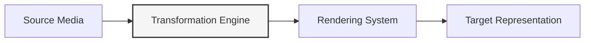
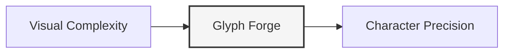

# ⚡ Glyph Forge: Architecture & Domain Map ⚡

> *"Precision-mapped characters that transform pixels into structural poetry."*

## 🔀 Core Machinery

Glyph Forge maps visual information to typographic elements through algorithmic precision. The transformation engine handles:

- 🖼️ **Images** → Character-density mappings with edge preservation
- 📝 **Text** → Multi-dimensional typographic structures
- 🎬 **Video** → Frame-coherent character sequences

## ⚙️ Processing Framework

Essential processing components:

- **Transformers** → Density mapping + edge detection algorithms
- **Renderers** → Environment-aware output generators
- **Services** → Zero-overhead orchestration layer

## 🧩 System Architecture

| Layer | Components | Purpose |
|-------|------------|---------|
| API | `ASCIIForgeAPI`, `get_api()` | Unified access with context awareness |
| Renderers | `TextRenderer`, `ANSIRenderer`, `HTMLRenderer`, `SVGRenderer` | Format-specific presentation systems |
| Transformers | `ImageTransformer`, `ColorMapper`, `DepthAnalyzer`, `EdgeDetector` | Media processing algorithms |
| Services | `image_to_ascii()`, `text_to_banner()`, `video_to_ascii_frames()` | Streamlined workflow interfaces |
| Utils | `setup_logger()`, `configure()`, `measure_performance()`, `detect_capabilities()` | Cross-cutting infrastructure |

## 🔧 Technical Requirements

- **Python**: 3.12+ (forward-compatible design)
- **Dependencies**: Essential libraries only:
  - `pillow` → Image transformation engine
  - `numpy` → Array computation framework
  - `rich` → Terminal rendering system
  - `pyfiglet` → Typography transformation
  - `colorama` → Cross-platform color handling
  - `typer` → CLI interface framework
- **Performance**: 0.09s average image processing time
- **Commands**: `asciify` & `bannerize` entry points
- **Configuration**: Runtime-adaptable parameters

## 📈 Release Timeline

| Version | Focus | Status |
|---------|-------|--------|
| 0.1.0 | Core transformation engine | ✓ Current |
| 0.2.0 | Extended renderer ecosystem | 🔄 Active Development |
| 0.3.0 | Pattern recognition system | 📝 Planned |
| 0.4.0 | Multi-format support expansion | 📝 Planned |
| 1.0.0 | API stabilization + performance tuning | 🔮 Roadmap |

## 👥 Team Structure

- **Lloyd Handyside** (<ace1928@gmail.com>) — Implementation Lead
- **Eidos** (<syntheticeidos@gmail.com>) — Architectural Principles
- **Neuroforge** (<lloyd.handyside@neuroforge.io>) — Organizational Framework

## 🧠 Implementation Philosophy

Glyph Forge embodies three core Eidosian principles:

1. **Contextual Integrity** — Each element exists for a precise purpose
2. **Humor as Cognitive Leverage** — "ASCII art without structure is like a function without parameters—accepting everything, controlling nothing"
3. **Exhaustive But Concise** — Complete functionality in minimal space

## 🎯 Transformation Goals

Each transformation preserves:

- 🔍 Feature hierarchy with structural emphasis
- 🧬 Spatial relationships between elements
- 📊 Context-appropriate density distribution
- 🎨 Environment-aware color representation

## 🔌 Integration Interfaces

- 💻 Terminal interaction through command-line tools
- 🐍 Programmatic API with consistent contracts
- 🖨️ Multiple output formats (text, ANSI, HTML, SVG)
- 🧩 Extensible transformation pipeline

## 🔭 Feature Boundaries

- ✅ **Core Features**: Static images, text banners, video frames
- 🔄 **In Evaluation**: 3D projections, animated formats, custom mappings
- ❌ **Excluded**: Real-time video processing, complex animations

## 📝 Character Mappings

| Set | Purpose | Characters |
|-----|---------|------------|
| `standard` | Universal compatibility | `.:-=+*#%@` |
| `detailed` | High-resolution output | `.'^\",;Il!i><~+_-?][}{1)(\|/tfj...` |
| `block` | Block graphics mode | `░▒▓█` |
| `minimal` | Low-complexity output | `.:*#` |
| `block-extended` | Advanced block graphics | `░▒▓█▀▄▌▐■□▬▭▮▯` |
| `eidosian` | Symbolic representation | `⚡✧✦⚛⚘⚔⚙⚚⚜⛭⛯❄❈❉❊` |

*"Structure that lacks purpose is merely visual occupation of space."* — Eidos
