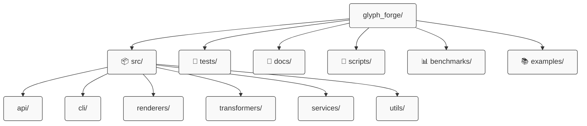
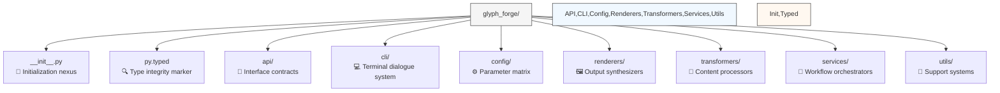
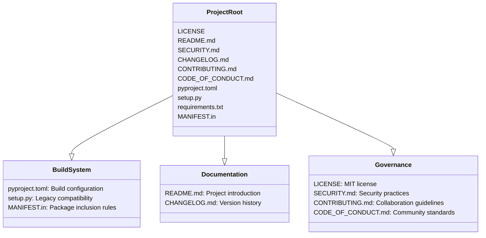
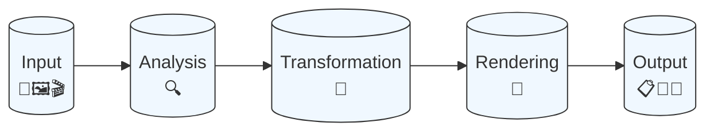

# 🔮 Glyph Forge Architecture Matrix

> *"Structure embodies intent; code manifests thought."*

## 🌐 System Topology



## 🧩 Component Structure

```tree
glyph_forge/
├── 📦 src/                 # Source nucleus - where thought becomes execution
│   └── glyph_forge/        # Package domain - character transformation engine
├── 🧪 tests/               # Verification matrix - hypothesis confirmation system
├── 📝 docs/                # Knowledge crystallization - clarity through structure
├── 🔧 scripts/             # Task automata - repetition elimination system
├── 📊 benchmarks/          # Performance analysis - optimization validation grid
└── 📚 examples/            # Implementation patterns - practical application guides
```

## ⚡ Source Implementation Grid



### 📦 Implementation Blueprint

```tree
src/glyph_forge/
├── __init__.py             # Entry gateway - versioning and exports
├── py.typed                # Type sentinel - static analyzer enablement
├── api/                    # Interface layer - contract definitions
│   ├── __init__.py         # API registry - capability exposure
│   └── glyph_forge_api.py  # Core interface - functionality access points
├── cli/                    # Command system - terminal interaction layer
│   ├── __init__.py         # Command registry - interaction entry points
│   ├── glyphfy.py          # Image transformer - pixels to glyphs
│   └── bannerize.py        # Text enhancer - typography system
├── config/                 # Settings matrix - behavior control center
│   ├── __init__.py         # Config registry - parameter discovery
│   └── settings.py         # Parameter definitions - behavior switches
├── renderers/              # Output generators - presentation engines
│   ├── __init__.py         # Renderer registry - format dispatchers
│   ├── text_renderer.py    # Text engine - universal output
│   ├── ansi_renderer.py    # Terminal engine - color-aware display
│   ├── html_renderer.py    # Web engine - browser-ready output
│   └── svg_renderer.py     # Vector engine - scalable graphics
├── transformers/           # Content processors - data mutation engines
│   ├── __init__.py         # Transformer registry - processor lookup
│   ├── image_transformer.py # Image engine - pixel-to-character mapping
│   ├── color_mapper.py     # Color engine - spectrum translation
│   ├── depth_analyzer.py   # Depth engine - dimensional processing
│   └── edge_detector.py    # Edge engine - boundary identification
├── services/               # Workflow directors - high-level operations
│   ├── __init__.py         # Service registry - workflow discovery
│   ├── image_to_glyph.py   # Image pipeline - photo transformation
│   ├── text_to_banner.py   # Text pipeline - banner generation
│   └── video_to_glyph_frames.py # Video pipeline - motion conversion
└── utils/                  # Support tools - cross-cutting functions
    ├── __init__.py         # Utility registry - helper discovery
    ├── setup_logger.py     # Logging system - event recording
    ├── performance.py      # Metrics system - efficiency tracking
    └── capabilities.py     # Environment inspector - system awareness
```

## 🧪 Test Matrix

```tree
tests/
├── __init__.py             # Test root - namespace identifier
├── conftest.py             # Test fixtures - reusable components
├── integration/            # System tests - cross-module verification
│   ├── __init__.py         # Integration scope - test boundary marker
│   └── test_pipeline.py    # Pipeline tests - end-to-end validation
└── unit/                   # Component tests - isolated verification
    ├── __init__.py         # Unit scope - test boundary marker
    ├── test_transformers/  # Transformer tests - conversion checks
    ├── test_renderers/     # Renderer tests - output format checks
    └── test_services.py    # Service tests - workflow validation
```

## 🔧 Automation Grid

```tree
scripts/
├── benchmark.py            # Performance analyzer - execution profiler
├── release.py              # Release builder - distribution packager
├── generate_docs.py        # Documentation compiler - knowledge assembler
└── demo_generator.py       # Example creator - showcase builder
```

## 📜 Project Infrastructure



## 🧠 Architecture Extensions

```tree
src/glyph_forge/
├── core/                   # Core systems - foundational components
│   ├── protocols.py        # Interface contracts - structural patterns
│   ├── types.py            # Type definitions - data shape specifications
│   └── errors.py           # Exception system - error classifications
├── extensions/             # Extension framework - capability expansion
│   ├── __init__.py         # Extension registry - plugin discovery
│   ├── plugin_loader.py    # Plugin system - dynamic module loading
│   └── plugin_interface.py # Plugin contracts - extension protocols
└── observability/          # Insight framework - system transparency
    ├── __init__.py         # Observability tools - monitoring registry
    ├── tracing.py          # Execution tracker - operation flow recorder
    └── metrics.py          # Performance monitor - execution statistics
```

## 📦 Distribution Architecture

```tree
├── dist/                   # Distribution packages - deployment artifacts
│   ├── glyph_forge-0.1.0-py3-none-any.whl  # Wheel package - binary distribution
│   └── glyph_forge-0.1.0.tar.gz            # Source archive - code distribution
├── build/                  # Build artifacts - intermediate outputs
└── .github/                # GitHub integration - automation framework
    ├── workflows/          # CI/CD pipelines - process automation
    │   ├── tests.yml       # Test runner - validation automation
    │   └── publish.yml     # Publisher - release automation
    └── ISSUE_TEMPLATE/     # Issue templates - report standardization
```

## 🧰 Resource Organization

```tree
src/glyph_forge/resources/  # Asset storage - supporting files
├── charsets/               # Character sets - glyph building blocks
│   ├── standard.json       # Standard set - balanced intensity map
│   ├── detailed.json       # Enhanced set - precision intensity map
│   ├── block.json          # Block set - geometric intensity map
│   └── eidosian.json       # Signature set - symbolic intensity map
├── fonts/                  # Typography - text styling definitions
└── templates/              # Output patterns - rendering blueprints
    ├── html/               # Web templates - browser output formats
    └── ansi/               # Terminal templates - console output formats
```

## 💎 Character Matrices

- Standard characters (intensity gradient)

 .:-=+*#%@

- Detailed characters (precision spectrum)

 .'`^\",:;Il!i><~+_-?][}{1)(|/tfjrxnuvczXYUJCLQ0OZmwqpdbkhao*#MW&8%B@$

- Block characters (geometric representation)

░▒▓█

- Minimal set (core representation)

 .:*#

- Eidosian symbols (conceptual encoding)

⚡✧✦⚛⚘⚔⚙⚚⚜⛭⛯❄❈❉❊

## 🔄 Core Transformation Pipeline



## ⚙️ Configuration Matrix

Default configuration pattern alignment:

```python
DEFAULT_CONFIG = {
    "char_sets": {
        "standard": " .:-=+*#%@",
        "detailed": " .'`^\",:;Il!i><~+_-?][}{1)(|/tfjrxnuvczXYUJCLQ0OZmwqpdbkhao*#MW&8%B@$",
        "block": "░▒▓█",
        "minimal": " .:*#",
        "quantum": "░▒▓█▀▄▌▐■□▬▭▮▯",
        "eidosian": "⚡✧✦⚛⚘⚔⚙⚚⚜⛭⛯❄❈❉❊",
    },
    "color_modes": ["none", "ansi16", "ansi256", "truecolor", "rgb", "web"],
    "default_width": 80,
    "default_height": 24,
    "dither_algorithms": ["none", "floyd-steinberg", "jarvis", "stucki", "atkinson", "burkes", "sierra"],
    "optimization_level": 2,
    "entropy_preservation": True,
}
```

---

*Glyph Forge: Where pixels crystallize into glyphs* ✨

Maintained by:

- Lloyd Handyside (<ace1928@gmail.com>)
- Eidos (<syntheticeidos@gmail.com>)
- [Neuroforge](https://neuroforge.io) (<lloyd.handyside@neuroforge.io>)

> "In the matrix of characters, each glyph serves a purpose." — Eidos
